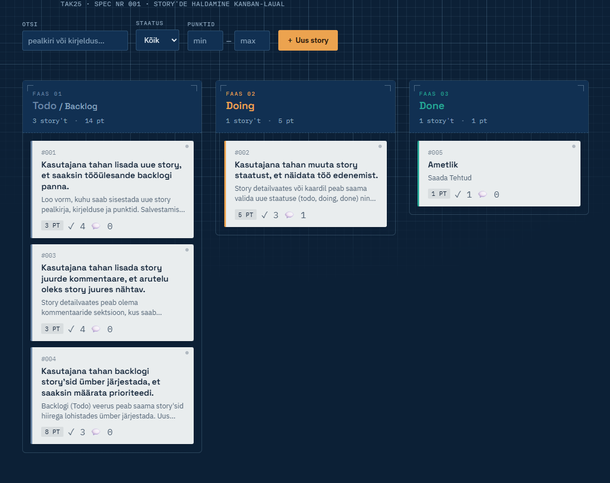

# Agile Tracker

Agiilse tarkvaraprojekti story'de haldamise Kanban-tööriist. TAK25 kooliprojekt.

Kolm veergu (**Todo / Backlog**, **Doing**, **Done**), REST API, hiirega lohistatav
backlogi järjestamine ja kommentaarid iga story juures.



---

## 1. Mis tehnoloogiaid kasutasid?

**Backend**
- Node.js + [Express](https://expressjs.com/) — REST API ja staatiliste failide serveerimine
- Andmete salvestamine JSON-faili (`data/stories.json`) kettal — lihtne, sõltuvusteta ja
  töökindel lahendus (`better-sqlite3` ei kompileerunud kasutatava Node.js versiooniga,
  seega valiti fail-põhine hoidla, mis on samasuguse liidesega ja kergesti hiljem
  päris andmebaasi vastu vahetatav)
- Node.js sisseehitatud test runner (`node --test`) automaattestideks

**Frontend**
- Vanilla HTML / CSS / JavaScript, ilma raamistiku ega build-sammuta
- Natiivne HTML5 Drag & Drop API backlogi ja veergudevahelise lohistamise jaoks
- Google Fonts: Space Grotesk, IBM Plex Sans, IBM Plex Mono

Ei kasutata ühtegi frontend-raamistikku (React/Vue jne) ega ORM-i — kõik on
teadlikult lihtsana hoitud, et kood oleks üheselt loetav ja hõlpsalt seletatav.

## 2. Kuidas rakendus käivitada?

Eeldus: Node.js (testitud versiooniga 22, peaks töötama ka 18+).

```bash
npm install
npm start
```

Rakendus käivitub aadressil **http://localhost:3000**.

Arendusrežiimis (serveri automaatne taaskäivitus faili muutmisel):

```bash
npm run dev
```

Automaattestide käivitamiseks:

```bash
npm test
```

Testid kasutavad ajutist andmefaili (`os.tmpdir()`), mistõttu need ei muuda
ega kustuta päris `data/stories.json` sisu.

Vaikimisi port on `3000` ja andmefail `data/stories.json` — mõlemat saab muuta
keskkonnamuutujatega `PORT` ja `DATA_FILE`, nt:

```bash
PORT=4000 DATA_FILE=./data/minu-stories.json npm start
```

## 3. Millised funktsioonid valmis said?

- [x] Repo struktuur ja rakenduse käivitumine
- [x] Kanban laud kolme veeruga (Todo/Backlog, Doing, Done)
- [x] Story lisamine, muutmine ja kustutamine (koos kinnitusdialoogiga)
- [x] Story staatuse muutmine (nii lohistades kui vormi kaudu)
- [x] Backlogi hiirega lohistatav ümberjärjestamine, mis **säilib lehe uuendamisel**
      (järjekord salvestatakse `priority` väljana andmefaili)
- [x] Punktid (täisarvud, valideeritud: mitte tühjad, mitte negatiivsed, arusaadav veateade)
- [x] Vastuvõtutingimused (vähemalt üks kohustuslik, dünaamiline lisamine/eemaldamine)
- [x] Kommentaarid koos lisamise ajaga, sh kommentaari **kustutamine**
- [x] Andmete püsiv salvestamine (JSON-fail kettal)
- [x] Täielik REST API (vt allpool) koos sobivate HTTP staatusekoodidega
- [x] **Lisavõimalused:** story detailvaade (modal), otsing pealkirja/kirjelduse järgi,
      filtreerimine staatuse ja punktivahemiku järgi, punktide summa iga veeru all,
      loomise/muutmise kuupäevad, kommentaari kustutamine, drag-and-drop
      *kõikide* veergude vahel (mitte ainult backlogis), sobivad HTTP
      staatusekoodid (400/404/201/204), automaattestid REST API jaoks
      (`npm test`, 10 testi)
- [x] Läbivalt eestikeelne kasutajaliides ja veateated

## 4. Millised funktsioonid jäid pooleli?

- Kasutajate/rollide haldus (sisselogimine) — ülesanne seda ei nõudnud, kuid
  mitme kasutaja stsenaariumi jaoks oleks see järgmine loogiline samm.
- Backendis on olemas otsingu/filtreerimise tugi ka päringuparameetrite kaudu
  (`GET /api/stories?status=&search=&minPoints=&maxPoints=`), aga
  kasutajaliides rakendab filtreid hetkel kliendi poolel juba laaditud
  andmete peal (kiirem UX), mitte iga filtrimuutuse peale uue päringuga.
- Ekraanipilt tuleb lisada käsitsi enne lõplikku esitamist (vt üleval).
- Andmefaili kirjutamine ei kasuta faililukku — samaaegsel kasutamisel mitme
  brauseri poolt on väga väike võimalus kirjutuste kattumiseks (üksikkasutaja
  koolitöö kontekstis pole see praktikas probleem).

## 5. Millised olid kõige keerulisemad kohad?

- **Backlogi järjekorra säilitamine läbi kahe kihi.** Igal story'l on globaalne
  `priority` väli, aga kasutajale kuvatakse iga veerg eraldi ja filtreeritult.
  Kõige keerulisem oli lohistamise drop-sündmuse põhjal õigesti arvutada, kuhu
  täpselt globaalses järjekorras kaart peaks maanduma — eriti kui kaart
  liigub samal ajal ka teise staatuse veergu või kui otsingufilter on aktiivne
  ja osa kaarte pole üldse nähtaval.
- **REST API ja UI vahelise vea-side.** Valideerimisvead (nt negatiivsed
  punktid, puuduv vastuvõtutingimus) pidid tekkima nii serveris (turvaline
  API) kui kajastuma kasutajale arusaadava eestikeelse teatena, ilma et
  loogika kahes kohas dubleeruks liiga palju.
- **Andmebaasi valik.** Esialgu prooviti `better-sqlite3`, aga see ei
  kompileerunud kasutatava Node.js versiooniga. Üle mindi JSON-faili
  põhisele lahendusele, mis nõudis andmehoidla kihi (`src/dataStore.js`)
  disainimist selliselt, et see oleks hiljem hõlpsasti asendatav päris
  andmebaasiga ilma routerite koodi muutmata.

---

## REST API

Baas-URL: `/api/stories`

| Meetod | Tee | Kirjeldus |
|---|---|---|
| `GET` | `/api/health` | Tervisekontroll (`{ "status": "ok", "uptime": ... }`), kasulik monitooringuks |
| `GET` | `/api/stories` | Kõik story'd (prioriteedi järjekorras). Valikulised päringuparameetrid: `status`, `search`, `minPoints`, `maxPoints` |
| `GET` | `/api/stories/:id` | Ühe story detailid |
| `POST` | `/api/stories` | Uue story loomine (`title`, `description`, `status`, `points`, `acceptanceCriteria`) |
| `PUT` | `/api/stories/:id` | Story muutmine |
| `DELETE` | `/api/stories/:id` | Story kustutamine |
| `PATCH` | `/api/stories/:id/status` | Story staatuse muutmine (`{ "status": "doing" }`) |
| `PATCH` | `/api/stories/reorder` | Backlogi/story'de järjekorra uuendamine (`{ "orderedIds": [4,1,3,2] }`) |
| `POST` | `/api/stories/:id/comments` | Kommentaari lisamine (`{ "text": "..." }`) |
| `DELETE` | `/api/stories/:id/comments/:commentId` | Kommentaari kustutamine *(lisavõimalus)* |

**Veakoodid:** `400` vigase sisendi korral (koos `error`/`errors` sõnumiga),
`404` kui story või kommentaar ei leitud, `201` loomisel, `204` kustutamisel,
`200` muul õnnestunud juhul.

Näide (curl):

```bash
curl -X POST http://localhost:3000/api/stories \
  -H "Content-Type: application/json" \
  -d '{"title":"Uus story","description":"...","status":"todo","points":5,"acceptanceCriteria":["Tingimus 1"]}'
```

---

## Projekti struktuur

```
agile-tracker/
├── server.js                 # rakenduse käivituspunkt
├── src/
│   ├── app.js                 # Express app (testitav, ilma listen()-ita)
│   ├── dataStore.js           # JSON-fail andmehoidla (CRUD, reorder, kommentaarid)
│   ├── validation.js          # sisendi valideerimine + eestikeelsed veateated
│   └── routes/stories.js      # REST API endpoint'id
├── data/stories.json          # andmed (sh 4 näidisstory't)
├── public/                    # frontend (HTML/CSS/JS, ilma build-sammuta)
│   ├── index.html
│   ├── css/style.css
│   └── js/app.js
├── tests/api.test.js          # automaattestid (node --test)
├── package.json
└── README.md
```

---

## GitHubi töövoog (issue'd, feature branch'id, mikrocommitid)

See kood on valminud terviklikult, aga ülesanne nõuab, et **arendusprotsess
oleks GitHubis nähtav** issue'de, feature branch'ide ja väikeste commitide
kaudu. See osa (15% hindest) tuleb sul endal reaalselt oma kontol läbi teha —
seda ei saa keegi sinu eest tagantjärgi ära teha, kuna õpetaja hindab
sinu enda repo ajalugu.

**1. Loo repo (õige nimega, enne arendust):**

```bash
# vaheta "olavi" oma eesnime vastu, kui see pole õige
# (nimi tuletatud sinu varasemast GitHub kasutajanimest Olavi404)
git init
git remote add origin https://github.com/vikk-tak25/olavi-agile-tracker.git
```

**2. Loo GitHubis issue iga suurema funktsiooni kohta**, nt:

| # | Issue pealkiri | Soovituslik branch |
|---|---|---|
| 1 | Projekti seadistus (Express, staatiline server) | `1-projekti-seadistus` |
| 2 | Kanban laua vaade (3 veergu) | `2-kanban-vaade` |
| 3 | Story lisamine | `3-story-lisamine` |
| 4 | Story muutmine ja kustutamine | `4-story-muutmine-kustutamine` |
| 5 | Backlogi hiirega lohistamine | `5-backlogi-lohistamine` |
| 6 | Punktid ja vastuvõtutingimused | `6-punktid-tingimused` |
| 7 | Kommentaarid | `7-kommentaarid` |
| 8 | REST API endpoint'id | `8-rest-api` |
| 9 | Otsing ja filtreerimine | `9-otsing-filtreerimine` |
| 10 | Automaattestid | `10-testid` |

**3. Iga issue jaoks:**

```bash
git checkout -b 3-story-lisamine
# lisa/muuda vastavad failid selle funktsiooni jaoks
git add src/routes/stories.js
git commit -m "3: lisa POST /api/stories endpoint"
git push -u origin 3-story-lisamine
# ... tee veel mõni väike commit sama branch'i peal ...
git commit -m "3: lisa story loomise vorm frontendis"
git push
```

Kasutades igas branch'is mitut väikest commiti (nt eraldi backend, eraldi
frontend, eraldi valideerimine), tekib GitHubis loomulik ja jälgitav ajalugu,
mida õpetaja saab vaadata.

**4. Merge'i branch põhiharusse** (GitHubis "Pull Request" → "Merge"), enne
kui alustad järgmist issue't.

**5. Lisa lõppu:**
- ekraanipilt töötavast rakendusest
- see README (juba olemas)
